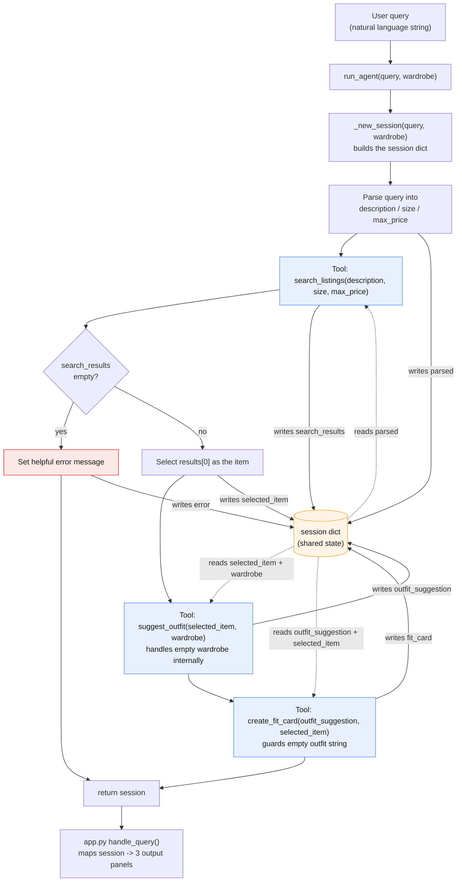

# FitFindr — planning.md

> Complete this document before writing any implementation code.
> Your spec and agent diagram are what you'll use to direct AI tools (Claude, Copilot, etc.) to generate your implementation — the more specific they are, the more useful the generated code will be.
> Your planning.md will be reviewed as part of your submission.
> Update it before starting any stretch features.

---

## Tools

List every tool your agent will use. For each tool, fill in all four fields.
You must have at least 3 tools. The three required tools are listed — add any additional tools below them.

### Tool 1: search_listings

**What it does:**
<!-- Describe what this tool does in 1–2 sentences -->
Searches the mock listings dataset (loaded via `load_listings()`) and returns the items matching the user's request. It filters by an optional size and an optional price ceiling, then scores the remaining listings by keyword overlap between `description` and each listing's `title`, `description`, and `style_tags`, dropping anything with a score of 0.

**Input parameters:**
<!-- List each parameter, its type, and what it represents -->
- `description` (str): Keywords describing the desired item, e.g. `"vintage graphic tee"`. Scored (case-insensitive) against each listing's `title`, `description`, and `style_tags`.

- `size` (str | None, default `None`): Size to filter by, matched case-insensitively as a substring so `"M"` matches `"S/M"`. If `None`, the size filter is skipped.

- `max_price` (float | None, default `None`): Inclusive maximum price. Listings with `price > max_price` are excluded. If `None`, no price ceiling is applied.

**What it returns:**
<!-- Describe the return value — what fields does a result contain? -->
A `list[dict]` of matching listings, sorted by relevance score (best match first). Each dict has the `listing.json` fields: `id` (str), `title` (str), `description` (str), `category` (str), `style_tags` (list[str]), `size` (str), `condition` (str), `price` (float), `colors` (list[str]), `brand` (str), `platform` (str). On no match, returns an empty list `[]`, never `None`, never an exception.

**What happens if it fails or returns nothing:**
<!-- What should the agent do if no listings match? -->
Returns `[]`. The planning loop detects the empty list, sets a user-facing message in `session["error"]` suggesting concrete adjustments (raise the price cap, drop or change the size, use broader keywords), and returns early. It does **not** call `suggest_outfit`.

---

### Tool 2: suggest_outfit

**What it does:**
<!-- Describe what this tool does in 1–2 sentences -->
Given the selected item and the user's wardrobe, calls the LLM (Groq `llama-3.3-70b-versatile`) to suggest 1–2 complete outfits that pair the new item with specific pieces the user already owns.

**Input parameters:**
<!-- List each parameter, its type, and what it represents -->
- `new_item` (dict): The listing dict selected by the planning loop (top `search_listings` result). Same shape as a `search_listings` result.

- `wardrobe` (dict): A wardrobe dict with an `"items"` key holding a list of wardrobe-item dicts. Each item has `id` (str), `name` (str), `category` (str - one of tops/bottoms/outerwear/shoes/accessories), `colors` (list[str]), `style_tags` (list[str]), and optional `notes` (str). `items` may be empty.

**What it returns:**
<!-- Describe the return value -->
A non-empty `str`: 1–2 concrete outfit suggestions (a few sentences) naming specific wardrobe pieces, e.g. *"Pair this with your baggy dark-wash jeans and chunky white sneakers for a 90s streetwear look and throw the vintage black denim jacket over it when it's cooler."*

**What happens if it fails or returns nothing:**
<!-- What should the agent do if the wardrobe is empty or no outfit can be suggested? -->
If `wardrobe["items"]` is empty, the tool does not crash. It prompts the LLM for **general** styling advice for the item on its own (what pairs well, what vibe it suits) and returns that string. If the LLM call errors, it returns a safe fallback styling string rather than raising an exception or returning `""`.

---

### Tool 3: create_fit_card

**What it does:**
<!-- Describe what this tool does in 1–2 sentences -->
Takes the outfit suggestion and the selected item and calls the LLM to generate a short, casual, shareable caption like an OOTD-style post for Instagram/TikTok. Uses a higher temperature so repeated calls on the same input produce varied captions.

**Input parameters:**
<!-- List each parameter, its type, and what it represents -->
- `outfit` (str): The styling suggestion returned by `suggest_outfit`.
- `new_item` (dict): The same selected listing dict, used so the caption can reference the item's `title`, `price`, and `platform`.

**What it returns:**
<!-- Describe the return value -->
A `str`: a 2–4 sentence caption in a casual, authentic first-person voice that mentions the item name, price, and platform naturally (once each) and captures the outfit's vibe in specific terms, e.g. *"thrifted this faded band tee off depop for $22 and honestly it was made for my baggy jeans 🖤 styled it with the chunky sneakers for that 90s feel — full look in my stories."* Different inputs (and repeated calls) produce different captions.

**What happens if it fails or returns nothing:**
<!-- What should the agent do if the outfit data is incomplete? -->
If `outfit` is empty or whitespace-only, the tool does **not** call the LLM. It returns a descriptive error string (e.g. *"Can't write a fit card yet - no outfit was suggested."*). If the LLM call errors, it returns a safe fallback caption string rather than raising an error.

---

### Additional Tools (if any)

<!-- Copy the block above for any tools beyond the required three -->

---

## Planning Loop

**How does your agent decide which tool to call next?**
<!-- Describe the logic your planning loop uses. What does it look at? What conditions change its behavior? How does it know when it's done? -->
`run_agent(query, wardrobe)` receives a raw natural-language query and a wardrobe dict. The loop runs the tools in a conditional sequence, branching on what `search_listings` returns and it is not a fixed pipeline.

1. **Initialize.** Create the session with `_new_session(query, wardrobe)`.

2. **Parse the query.** Extract `description`, `size`, and `max_price` from the natural-language string and store them in `session["parsed"]`. Parsing approach: lightweight Python - regex for the price (`under $30` / `$30` -> `max_price=30.0`) and size (`size M`, ` M `, common tokens like XS/S/M/L/XL -> `size`), and the remaining cleaned text becomes `description`. If a field isn't present, it stays `None` (no filter). (This keeps parsing deterministic and testable; the LLM is reserved for the outfit/caption tools.)

3. **Search.** Call `search_listings(description, size, max_price)` and store the list in `session["search_results"]`.

4. **Branch on results.**
   - If `search_results` is empty: set `session["error"]` to a helpful message and **return the session early**. `selected_item`, `outfit_suggestion`, and `fit_card` all stay `None`. `suggest_outfit`/`create_fit_card` are never called.
   - If non-empty: set `session["selected_item"] = search_results[0]` (top relevance) and continue.

5. **Suggest outfit.** Call `suggest_outfit(session["selected_item"], session["wardrobe"])` and store the string in `session["outfit_suggestion"]`. (This tool handles the empty-wardrobe case internally, so the loop doesn't special-case it.)

6. **Create fit card.** Call `create_fit_card(session["outfit_suggestion"], session["selected_item"])` and store the string in `session["fit_card"]`.

7. **Return** the session.

The loop "knows it's done" when either (a) `fit_card` is set, or (b) it returned early via the error branch with `error` set.

---

## State Management

**How does information from one tool get passed to the next?**
<!-- Describe how your agent stores and accesses state within a session. What data is tracked? How is it passed between tool calls? -->

A single `session` dict is created by `_new_session()` at the start of `run_agent()` and threaded through every step. The user never re-enters anything between tools; each tool reads from and writes to this dict. Keys (matching `agent.py`):

- `session["query"]` - the original raw user query string.
- `session["parsed"]` - `{description, size, max_price}` extracted in the parse step; feeds `search_listings`.
- `session["search_results"]` - the full `list[dict]` from `search_listings`.
- `session["selected_item"]` - `search_results[0]`, the exact dict passed into both `suggest_outfit` and `create_fit_card`.
- `session["wardrobe"]` - the wardrobe dict passed in by the caller; read by `suggest_outfit`.
- `session["outfit_suggestion"]` - the string from `suggest_outfit`, passed into `create_fit_card`.
- `session["fit_card"]` - the final shareable caption from `create_fit_card`.
- `session["error"]` - `None` on the happy path; set to a user-friendly string if `search_listings` returns nothing.

Flow: parse -> `parsed` -> `search_listings` -> `search_results` -> `selected_item` → `suggest_outfit` -> `outfit_suggestion` -> `create_fit_card` -> `fit_card`. Because every tool reads the same dict, the item found in the search reaches the caption step without the user re-describing it.

---

## Error Handling

For each tool, describe the specific failure mode you're handling and what the agent does in response.

| Tool | Failure mode | Agent response |
|------|-------------|----------------|
| search_listings | No results match the query | Returns `[]`. Loop sets `session["error"]` to: "I couldn't find anything matching that. Try raising your price cap, removing the size filter, or using broader keywords (e.g. 'graphic tee' instead of 'vintage band tee')." Loop returns early and `suggest_outfit`/`create_fit_card` are not called and `fit_card` stays `None`. |
| suggest_outfit | Wardrobe is empty (`wardrobe["items"] == []`) | Detects the empty list and prompts the LLM for general styling advice for the item on its own, returning a useful string (e.g. "You haven't added any wardrobe pieces yet, so here's how I'd style this on its own: ..."). Never raises, never returns "". |
| create_fit_card | Outfit input is missing or incomplete | If `outfit` is empty/whitespace, skips the LLM and returns "Can't write a fit card yet - no outfit was suggested." If the LLM call errors, returns a safe fallback caption instead of raising. |

---

## Architecture

<!-- Draw a diagram of your agent showing how the components connect:
     User input → Planning Loop → Tools (search_listings, suggest_outfit, create_fit_card)
                                                                          ↕
                                                                   State / Session
     Show what triggers each tool, how state flows between them, and where error paths branch off.
     ASCII art, a Mermaid diagram (https://mermaid.js.org/syntax/flowchart.html), or an embedded
     sketch are all fine. You'll share this diagram with an AI tool when asking it to implement
     the planning loop and each individual tool. -->

The control flow runs top to bottom (solid black arrows). The `session` dict is the shared store every step reads from and writes to: solid labeled arrows into it are **writes**, dashed labeled arrows out of it are **reads**. The only early-termination branch is the empty-results path out of `search_listings`, which writes `error` and jumps straight to `return session`, skipping `suggest_outfit` and `create_fit_card`.

---

## AI Tool Plan

<!-- For each part of the implementation below, describe:
     - Which AI tool you plan to use (Claude, Copilot, ChatGPT, etc.)
     - What you'll give it as input (which sections of this planning.md, your agent diagram)
     - What you expect it to produce
     - How you'll verify the output matches your spec before moving on

     "I'll use AI to help me code" is not a plan.
     "I'll give Claude my Tool 1 spec (inputs, return value, failure mode) and ask it to implement
     search_listings() using load_listings() from the data loader — then test it against 3 queries
     before trusting it" is a plan. -->

**Milestone 3 — Individual tool implementations:**

**Milestone 4 — Planning loop and state management:**

---

## A Complete Interaction (Step by Step)

Write out what a full user interaction looks like from start to finish — tool call by tool call. Use a specific example query.

**Example user query:** "I'm looking for a vintage graphic tee under $30. I mostly wear baggy jeans and chunky sneakers. What's out there and how would I style it?"

**Step 1:**
`run_agent()` parses the query into `session["parsed"] = {description: "vintage graphic tee", size: None, max_price: 30.0}`. (No explicit size in the query, so the size filter is skipped.)

**Step 2:**
The agent calls `search_listings("vintage graphic tee", size=None, max_price=30.0)`. This scores and filters the mock dataset and returns a relevance-sorted list, stored in `session["search_results"]`. The agent sets `session["selected_item"] = search_results[0]`, e.g. a *"Faded Band Tee — $22, Depop, good condition"* listing.

**Step 3:**
With a match found, the agent passes the item into `suggest_outfit(session["selected_item"], session["wardrobe"])`. Reading the example wardrobe (baggy dark-wash jeans, chunky white sneakers, vintage black denim jacket, etc.), it returns something like *"Pair this with your baggy dark-wash jeans and chunky white sneakers for a 90s streetwear look — layer the vintage black denim jacket on top when it's cooler."* Stored as `session["outfit_suggestion"]`.

**Step 4:**
The agent feeds the suggestion and item into `create_fit_card(session["outfit_suggestion"], session["selected_item"])`, which returns a caption like *"thrifted this faded band tee off depop for $22 and it was made for my baggy jeans 🖤 styled with the chunky sneakers and denim jacket for full 90s mode — look's in my stories."* Stored as `session["fit_card"]`.

**Error path:** If `search_listings` returns no matches, the agent sets `session["error"]` telling the user what to try differently (raise the price cap, loosen the description) and returns early, leaving `selected_item`, `outfit_suggestion`, and `fit_card` as `None`. This keeps the agent from calling `suggest_outfit` with an empty item.

**Final output to user:**
The three populated panels in the Gradio app, the listing found (Faded Band Tee, $22, Depop), the styling suggestion (baggy jeans + chunky sneakers + denim jacket, 90s streetwear), and the shareable fit card caption. On the error path the user instead sees the `error` message and empty outfit/fit-card panels.
